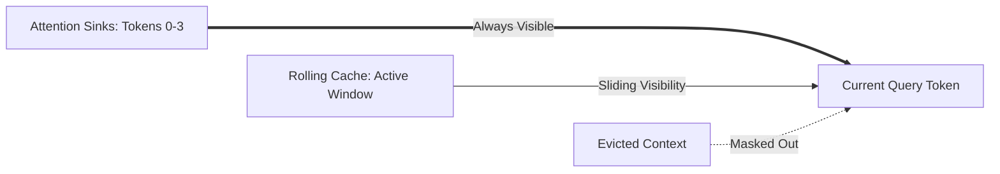

# Attention Sink Masking (StreamingLLM)

Attention Sinks resolve the memory limitations of streaming inference. Researchers discovered that the initial 2-4 tokens in a sequence absorb disproportionately high attention scores, serving as "sinks" that keep the model's activation values stable.

## Mechanism
The attention mask is designed to keep the first few tokens permanently visible to all subsequent queries, while applying a sliding rolling window cache to intermediate generated tokens.

## Cache Layout Diagram

[← Back to README](../README.md)
