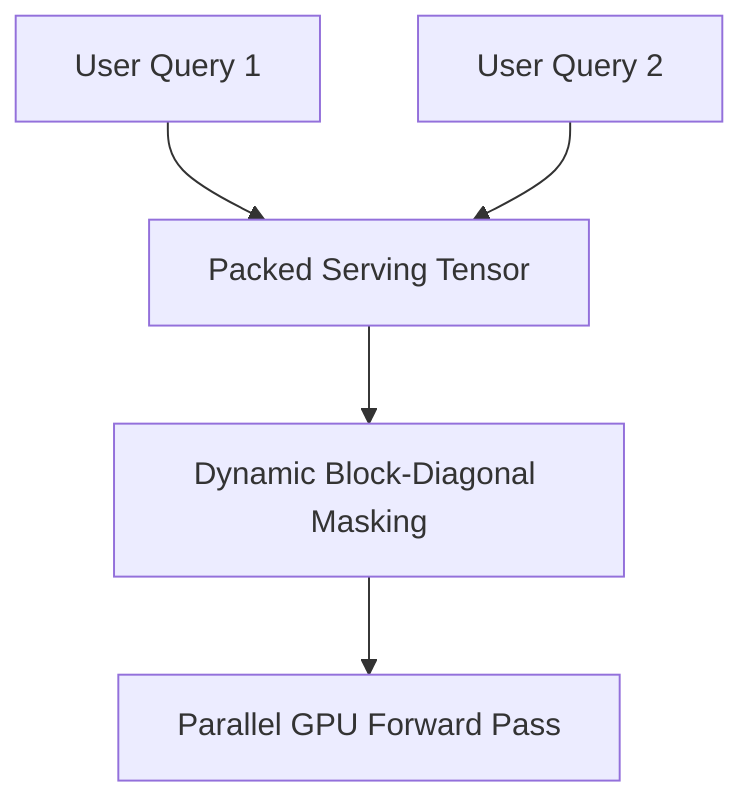

# High-Throughput Batch Inference Serving (vLLM / TensorRT-LLM)

Production serving systems pack multiple independent user inference queries into a single large batch to saturate GPU compute.

## Block-Diagonal Serving
By utilizing block-diagonal masking dynamically, vLLM schedules multiple queries with varying history lengths into a single continuous tensor, completely preventing context contamination.

[← Back to README](../README.md)
