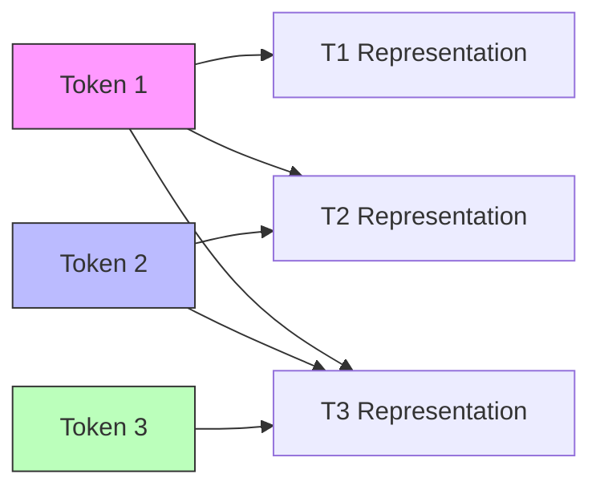

# Causal Masking (Lower-Triangular Mask)

Causal masking is the architectural foundation of autoregressive text generation. It prevents the model from attending to tokens that appear after the current query index, preserving temporal order.

## Mechanism
The causal mask $M$ is a lower-triangular matrix containing $0$ on and below the diagonal, and $-\infty$ above:

$$M = \begin{pmatrix} 
0 & -\infty & -\infty & \dots & -\infty \\ 
0 & 0 & -\infty & \dots & -\infty \\ 
0 & 0 & 0 & \dots & -\infty \\ 
\vdots & \vdots & \vdots & \ddots & \vdots \\ 
0 & 0 & 0 & \dots & 0 
\end{pmatrix}$$

## Information Flow

[← Back to README](../README.md)
