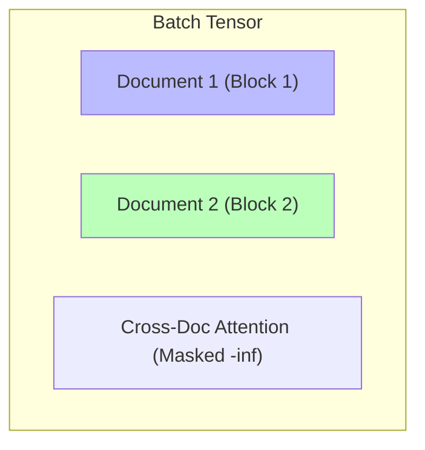

# Document Layout / Block-Diagonal Masking

To train Transformers efficiently, multiple short documents are often packed into a single training sequence. Document Layout (or Block-Diagonal) Masking prevents tokens from attending across document boundaries.

## Contamination Mitigation
Without block-diagonal masking, a token from Document A would attend to tokens in Document B, corrupting gradient updates. The mask creates isolated dense blocks along the diagonal.

## Matrix Visual

[← Back to README](../README.md)
