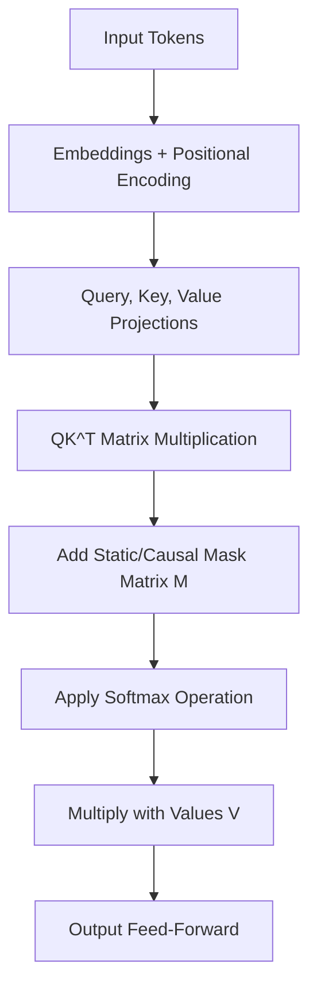

# The Foundation Era (Vaswani et al., 2017)

The technical implementation of attention masking began with the landmark paper *"Attention Is All You Need"* (Vaswani et al., 2017). This era established the two core paradigms of sequence restriction in self-attention models: **Padding Masking** and **Causal Masking**.

## Core Mechanisms
1. **Padding Masking:** Blocks trailing placeholder tokens (`[PAD]`) added to align sequence lengths in batch tensors.
2. **Causal Masking:** Prevents autoregressive decoders from "looking into the future" by zeroing out attention scores for tokens positioned ahead of the query token.

## Mathematical Representation
Given Query ($Q$), Key ($K$), and Value ($V$) matrices, attention masking is applied by adding a mask matrix $M$ before the softmax operation:
$$\text{Attention}(Q, K, V) = \text{softmax}\left(\frac{QK^T}{\sqrt{d_k}} + M\right)V$$
Where:
* $M_{ij} = 0$ for allowed attention paths.
* $M_{ij} = -\infty$ for masked attention paths.

## Architecture Diagram

## Key Limitations
* **Quadratic Scaling:** The mask is a static $N \times N$ grid, leading to $O(N^2)$ time and space complexity.
* **VRAM Bottlenecks:** On early GPU hardware, allocating explicit dense boolean masks for long sequences saturated device memory rapidly.

[← Back to README](../README.md)
