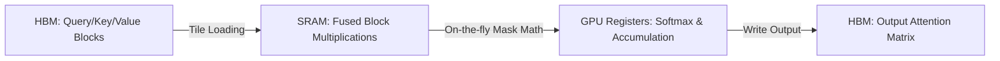

# The Hardware-Fused & Streaming Era (~2023–Present)

Modern long-context language models require discarding physical, memory-intensive attention matrices in favor of fused kernels that calculate attention dynamically inside GPU SRAM.

## Key Innovations
1. **FlashAttention:** Eliminates the physical allocation of the $N \times N$ attention mask in High Bandwidth Memory (HBM). Instead, the mask constraints are applied incrementally within low-level thread-block SRAM loops.
2. **StreamingLLM / Rolling Windows:** Combines localized sliding windows with dedicated "attention sinks" to process infinite context streams without memory degradation.

## Hardware Cache Flow

[← Back to README](../README.md)
