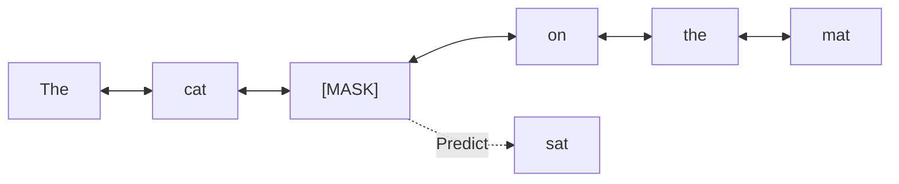

# Bi-directional Masked Language Modeling (MLM)

Introduced by BERT, Masked Language Modeling training involves replacing a percentage of input tokens with a special `[MASK]` token, requiring the model to predict the original tokens using context from both directions.

## Bidirectional Context
Because the model can look both left and right, it builds richer representations of sentence semantics compared to unidirectional causal models.

## Information Flow

[← Back to README](../README.md)
