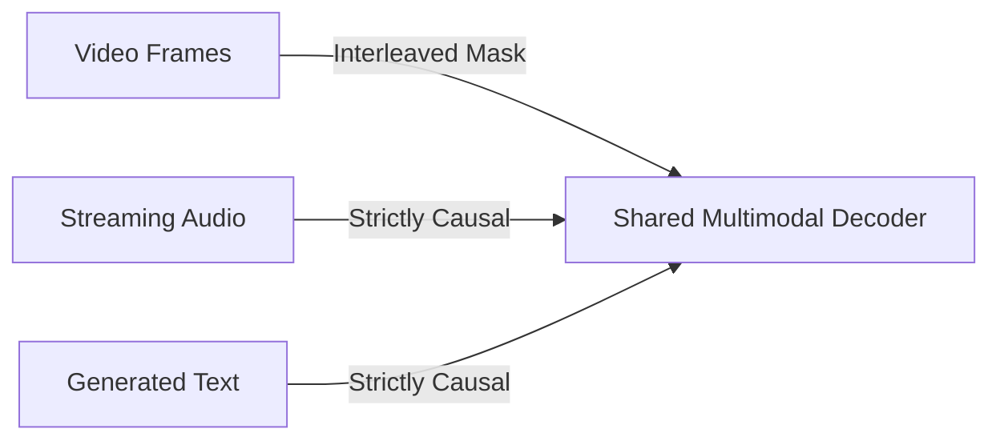

# Unified Multi-Modal Omni Conversational Engines

Omni conversational models (like GPT-4o) process text, audio, and visual streams concurrently, requiring advanced synchronization masks.

## Interleaved Masking
Interleaved multimodal masks ensure that the generative speech path responds to live visual token coordinate shifts while keeping temporal speech and text paths strictly causal.

[← Back to README](../README.md)
