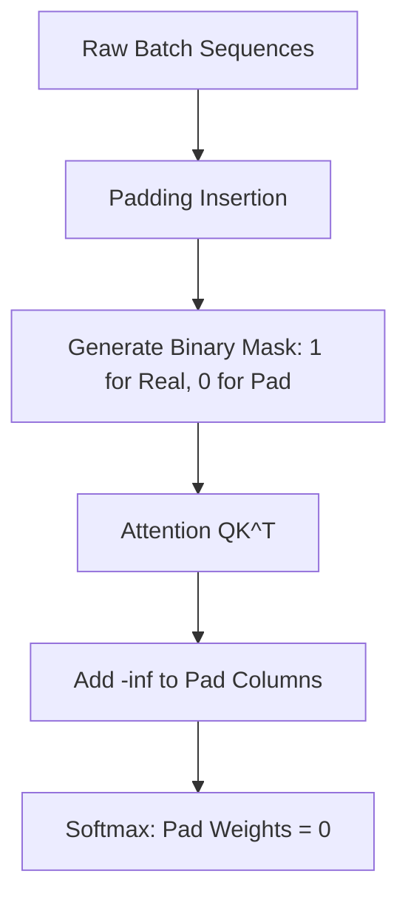

# Padding Masking

Padding masking prevents the model from attending to dummy placeholder tokens (`[PAD]`) inserted to make sequences within a batch uniform in length.

## Core Purpose
Because GPUs require rectangular matrices for batched computation, variable-length inputs must be padded. However, padding tokens contain no semantic information. The padding mask overrides attention scores targeting pad positions, mapping their post-softmax probability to exactly $0$.

## Mask Representation
```mermaid
grid
    Row1: [Token, Token, Token, PAD]
    Row2: [Token, Token, PAD,   PAD]
```



[← Back to README](../README.md)
