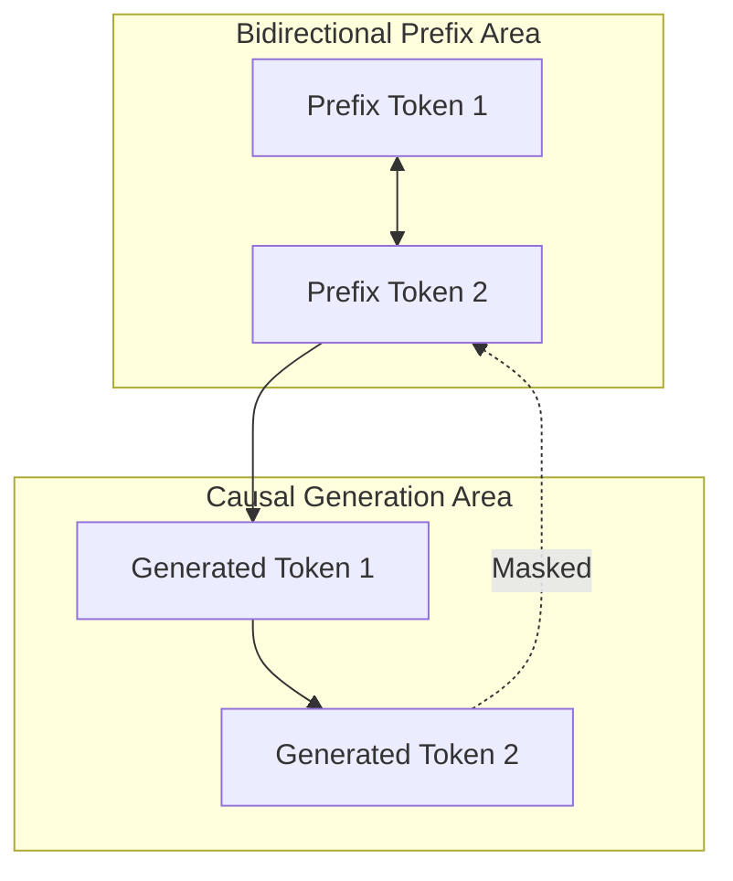

# Prefix / Unidirectional-to-Causal Hybrid Masking

Prefix masking bridges the gap between bidirectional comprehension and causal generation. It allows fully bidirectional attention over an initial prompt ("prefix"), followed by strict causal attention for generated tokens.

## Application
Commonly used in text-to-text models (such as T5 or UniLM) and decoders fine-tuned for prompt compliance.

## Mask Layout
For a sequence where the first $k$ tokens form the prefix and subsequent tokens are generated:

[← Back to README](../README.md)
