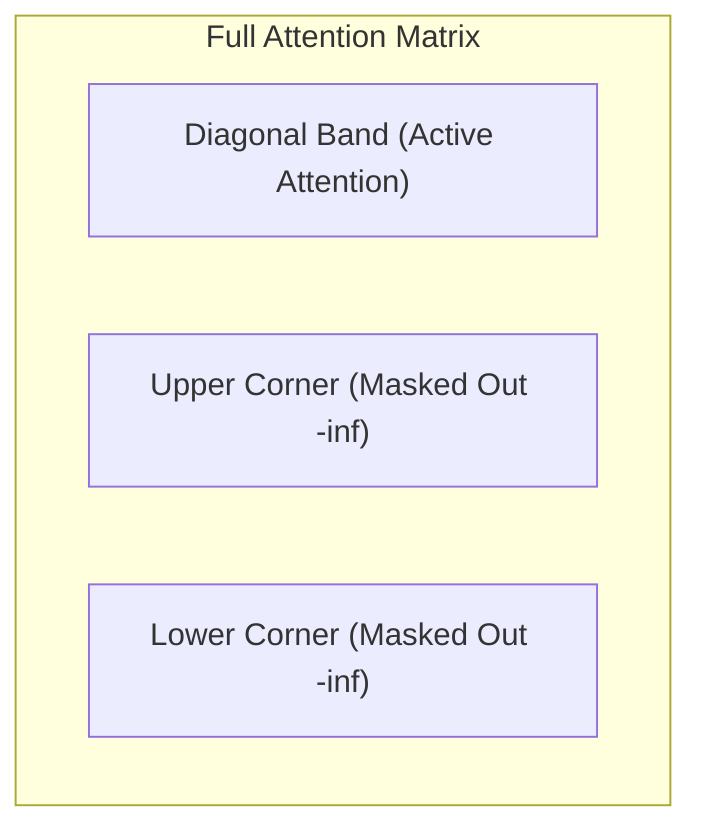

# Sliding Window Local Masking

Sliding Window Local Masking restricts the attention field of each token to a local context window $W$ surrounding it, reducing computation complexity from $O(N^2)$ to $O(N \cdot W)$.

## Mechanism
For a token at index $i$, attention is only permitted to keys at index $j$ where $|i - j| \le W/2$. All other keys are masked out.

## Matrix Layout

[← Back to README](../README.md)
