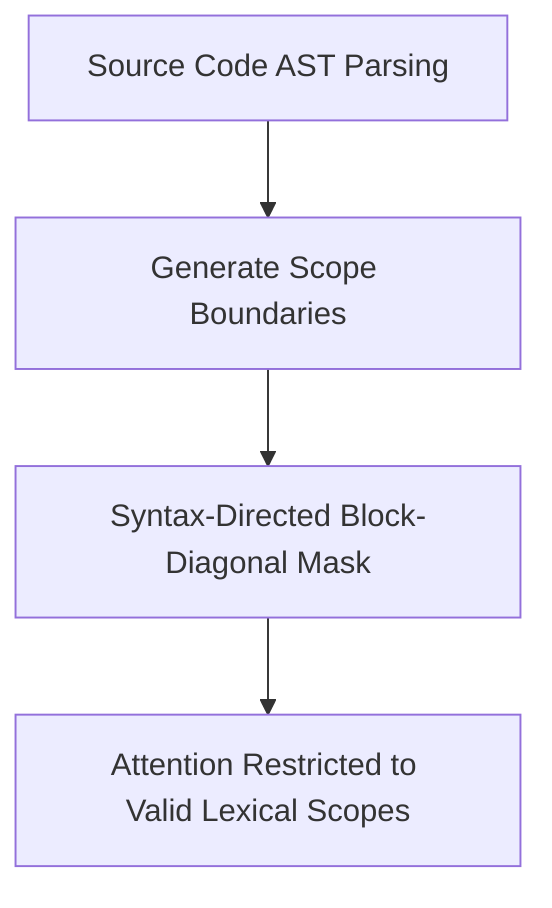

# Long-Context Software Repository Auditing

Auditing multi-directory codebases requires models to parse large file trees. Standard attention struggles with the noise of unrelated helper scripts.

## Syntax & Block-Sparse Masking
Repository auditing models use abstract syntax trees (AST) to generate syntax-directed masks, preventing variable lookups from crossing logical class boundaries.

[← Back to README](../README.md)
