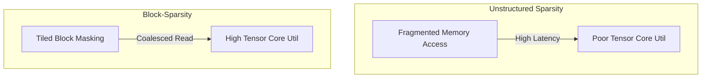

# The Unstructured Sparsity Performance Penalty

Unstructured sparse masking drops random, scattered tokens to reduce math operations. However, this causes severe performance bottlenecks on modern GPU architectures.

## The Hardware Challenge
GPUs are designed for block-based, uniform matrix math (dense calculations). Fragmented memory accesses break coalescing, leading to high latency.

## Solution: Block-Sparse Profiles
Instead of random token masking, mask regions are grouped into dense $16 \times 16$ or $64 \times 64$ tiles.

[← Back to README](../README.md)
