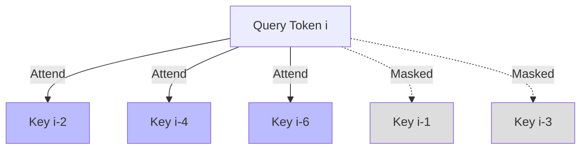

# Strided / Dilated Masking

Strided (or Dilated) masking allows attention heads to skip tokens at fixed intervals, expanding the model's overall receptive field without increasing computational complexity.

## Mechanism
Instead of attending to every contiguous neighbor, a token attends to indices $i - d, i - 2d, i - 3d$, where $d$ is the dilation stride.

## Grid Visual

[← Back to README](../README.md)
