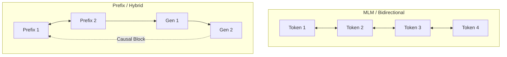

# The Tasks-Specific Layout Era (~2019–2022)

Following the initial success of the Transformer, architectures diverged to support non-generative tasks. Specialized attention masking patterns emerged to customize representation learning for encoder-only and encoder-decoder models.

## Architectural Adaptations
* **Masked Language Modeling (MLM):** Popularized by BERT (Devlin et al., 2018), this approach corrupts the input by replacing select tokens with `[MASK]`. The model uses fully bidirectional masking to reconstruct the original tokens from surrounding left-and-right contexts.
* **Prefix / Hybrid Masking:** Popularized by UniLM and T5, this model permits bidirectional attention over a prompt (or "prefix") but enforces strict causal masking on all subsequent generated tokens.

## Mask Comparison

[← Back to README](../README.md)
